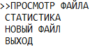

# Coursework
## Функционал
Программа реалезует работу с базой данных учетных записей по типу

``
имя фамилия баллы баллы баллы баллы
``

``
Ponchik Cobaki 100 100 100 300
``

## Функции:
- просмотр файла бызы
- создание учетной записи
- удаление учетной записи
- измениение учетной записи
- просмотр статистики

## Объявления
* Account.h - класс учетных записей
* Array.h - класс связывающий в масстив учетные записи с методами упраления массивом
* BinFO.h - библеотека для работы с бинырными файлами
* CMenu.h - библиотека создания меню программы в консоле
* Keyboard.h - библиотека обработки клавиш управления программой

