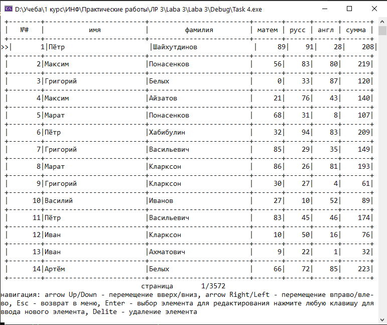

# Coursework
## Функционал
Программа реалезует работу с базой данных учетных записей по типу

номер |  имя   |  фамилия  | баллы по мат | баллы по рус | баллы по анг | суммарный балл
----- |------- | --------- | --------- | --------- | --------- | ------------
1     |Ponchik | Cobaki    | 100 | 100 | 100 | 300
2     |Dmitry  | Ivanov    | 100 |  50 | 100 | 250
n     |...     |...        | xxx | xxx | xxx | xxx

## Функции:
- просмотр файла бызы
- создание учетной записи
- удаление учетной записи
- измениение учетной записи
- просмотр статистики

## Объявления
 
* `` Account.h `` - класс учетных записей
* `` Array.h `` - класс связывающий в масстив учетные записи с методами упраления массивом
* `` BinFO.h `` - модуль для работы с бинарными файлами
* `` CMenu.h `` - модуль создания меню программы в консоле
* `` Keyboard.h `` - библиотека обработки клавиш клавиатуры
